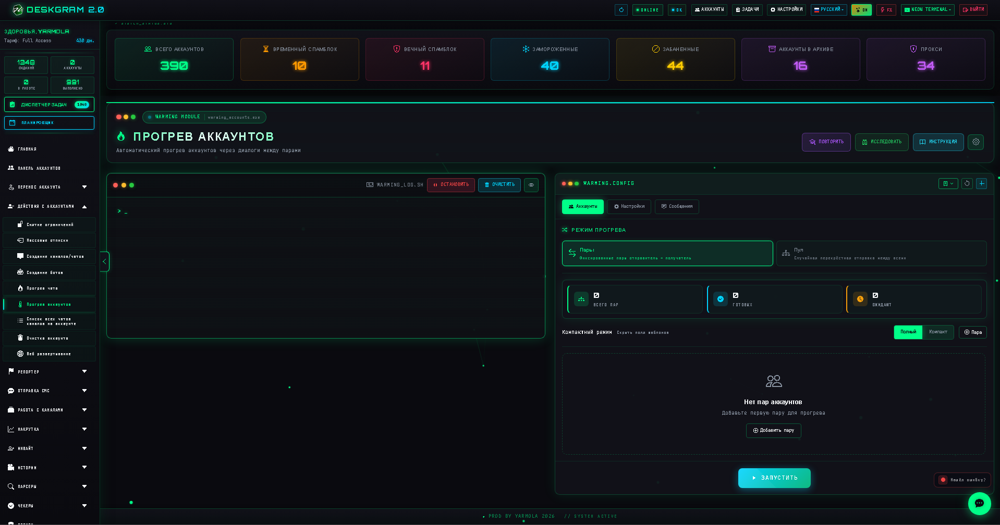
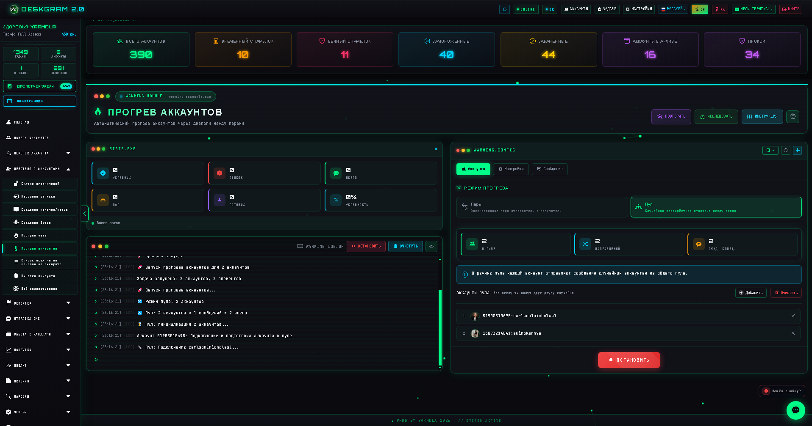
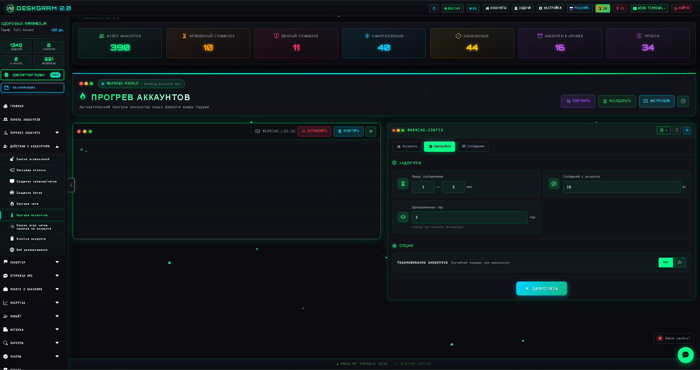
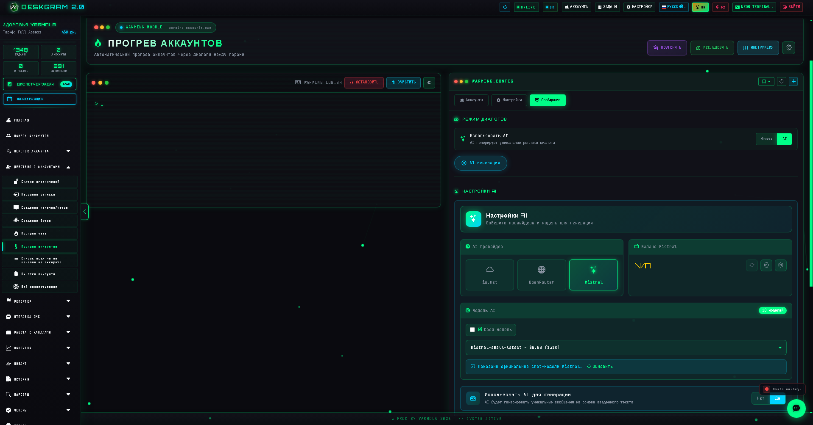

# Прогрев Telegram-аккаунтов через Deskgram 2

Прогрев аккаунтов в Deskgram 2 помогает подготовить Telegram-аккаунты к дальнейшей рабочей нагрузке через управляемые сценарии активности. Модуль полезен для аккуратного старта, распределения действий между аккаунтами и постепенного повышения рабочей устойчивости сетки.

[Главный хаб Deskgram 2](https://github.com/Deskgram-2/deskgram-2-telegram-automation) · [Сайт](https://deskgram2.com/) · [Telegram-бот](https://t.me/DG2welcomebot) · [Web preview](https://deskgram2.com/web-preview)
## Интерактивный Web Preview

Попробовать модуль в браузере: [Открыть веб-превью](https://deskgram2.com/web-preview?path=%2Fapp-demo%2Ffunctions%2Fwarming_accounts)

## Скриншоты

## Кратко о модуле

| Параметр | Что внутри |
|---|---|
| Основная задача | Прогрев Telegram-аккаунтов через сценарии активности |
| Важные блоки | Статистика, логи, режимы прогрева, настройки, блок сообщений |
| Полезен для | Подготовки аккаунтов, снижения резкости старта, инфраструктурного контроля |
| Связанные модули | Панель аккаунтов, Настройки, Массовые подписки |

## Что умеет модуль

- запускать сценарии прогрева по выбранным аккаунтам;
- работать с разными режимами и параметрами активности;
- показывать статистику успехов, ошибок и прогресс;
- задавать задержки, шаблоны и рабочие ограничения;
- использовать прогрев как подготовительный слой перед другими задачами.

## Быстрый старт

1. Выберите аккаунты для прогрева.
2. Настройте режим работы и интенсивность.
3. Задайте задержки и параметры сценария.
4. При необходимости настройте блок сообщений.
5. Запустите задачу и следите за статистикой.

## Куда обычно переходят после прогрева

- [Панель аккаунтов](https://github.com/Deskgram-2/telegram-account-manager-deskgram), если нужно дальше распределить подготовленные аккаунты по рабочим группам;
- [Управление прокси](https://github.com/Deskgram-2/telegram-proxy-manager-deskgram), если инфраструктура под нагрузку еще донастраивается;
- [Настройки](https://github.com/Deskgram-2/telegram-automation-settings-deskgram), если после прогрева вы выравниваете общие параметры системы;
- [Массовые подписки](https://github.com/Deskgram-2/telegram-join-groups-deskgram), если следующим шагом идет мягкая активность в сообществах;
- [Рассылка в ЛС](https://github.com/Deskgram-2/telegram-direct-messaging-deskgram), если аккаунты готовятся под коммуникационные сценарии;
- [Диспетчер задач](https://github.com/Deskgram-2/telegram-task-manager-deskgram), если хотите видеть прогрев и дальнейшие запуски в одной операционной ленте.

## Как устроен сценарий

### Режим работы

На старте задается логика прогрева: шаблонная, ручная или более гибкая сценарная конфигурация. Это определяет, как именно аккаунты будут накапливать активность.

### Ограничения и ритм

Параметры задержек и интенсивности помогают распределять нагрузку мягче и не делать старт слишком резким.

### Контроль результата

Статистика и лог позволяют видеть, сколько действий прошло успешно, где есть ошибки и как ведет себя общий процесс.

## Когда особенно полезен

- когда аккаунты только готовятся к рабочим задачам;
- когда нужно не запускать модули слишком резко;
- когда вы строите более устойчивую сетку аккаунтов;
- когда важен инфраструктурный контроль перед следующими сценариями.

## Почему это лучше ручного прогрева

| Ручной подход | Прогрев аккаунтов в Deskgram 2 |
|---|---|
| Трудно повторять одинаково | Сценарии стандартизируются |
| Сложно масштабировать на много аккаунтов | Работа идет по сетке |
| Почти нет нормальной статистики | Есть логи и показатели |
| Высокая нагрузка на оператора | Большая часть ритма задается заранее |

## Сценарии применения

- мягкая подготовка аккаунтов перед [массовыми подписками](https://github.com/Deskgram-2/telegram-join-groups-deskgram), если вы не хотите запускать активность слишком резко;
- прогрев базы перед [рассылкой в ЛС](https://github.com/Deskgram-2/telegram-direct-messaging-deskgram) и [инвайтом](https://github.com/Deskgram-2/telegram-invite-tool-deskgram), когда впереди коммуникационные сценарии;
- подготовка аккаунтов к более сложной активности вроде [нейрокомментинга](https://github.com/Deskgram-2/telegram-neuro-commenting-deskgram), комментариев и сторис-цепочек;
- инфраструктурный слой для командной работы, когда нужно выровнять ритм аккаунтов до запуска основной воронки.

## Что выбрать: прогрев или массовые подписки

| Если ваша задача | Что подходит лучше |
|---|---|
| Аккуратно подготовить аккаунты к дальнейшей нагрузке | `Прогрев аккаунтов` |
| Начать активность в сообществах и расширять присутствие | [Массовые подписки](https://github.com/Deskgram-2/telegram-join-groups-deskgram) |
| Снизить резкость старта перед коммуникационными модулями | `Прогрев аккаунтов` |
| Уже работать по группам и каналам после подготовки среды | [Массовые подписки](https://github.com/Deskgram-2/telegram-join-groups-deskgram) |

## Смежные репозитории

- [Главный хаб Deskgram 2](https://github.com/Deskgram-2/deskgram-2-telegram-automation)
- [Панель аккаунтов](https://github.com/Deskgram-2/telegram-account-manager-deskgram)
- [Настройки](https://github.com/Deskgram-2/telegram-automation-settings-deskgram)
- [Массовые подписки](https://github.com/Deskgram-2/telegram-join-groups-deskgram)
- [Управление прокси](https://github.com/Deskgram-2/telegram-proxy-manager-deskgram)
- [Рассылка в ЛС](https://github.com/Deskgram-2/telegram-direct-messaging-deskgram)
- [Диспетчер задач](https://github.com/Deskgram-2/telegram-task-manager-deskgram)

## FAQ

### Это обязательный модуль перед рабочими задачами?

Не всегда, но в инфраструктурных сценариях он очень полезен как подготовительный слой.

### Здесь можно гибко настраивать сценарий?

Да, модуль как раз и нужен для управления ритмом, параметрами и форматом прогрева.
